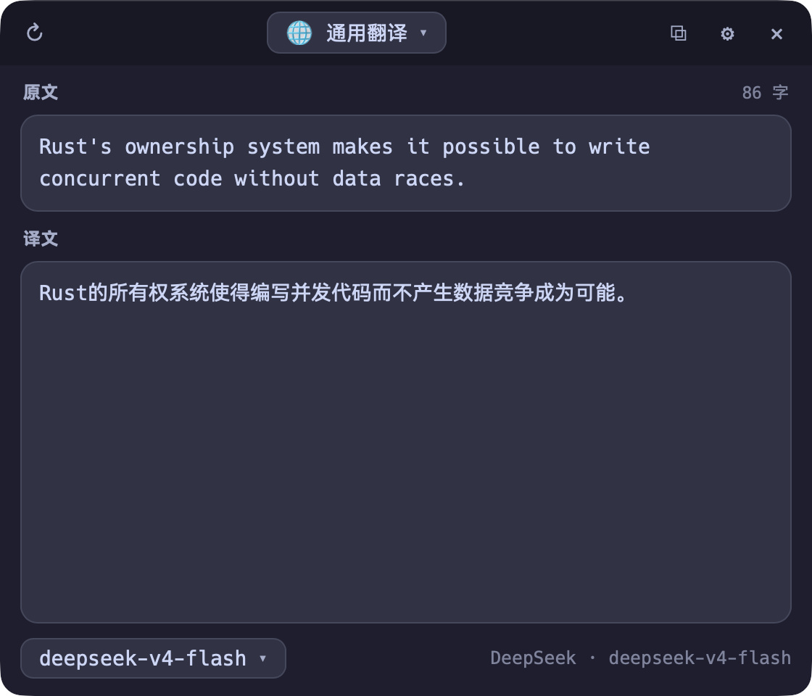
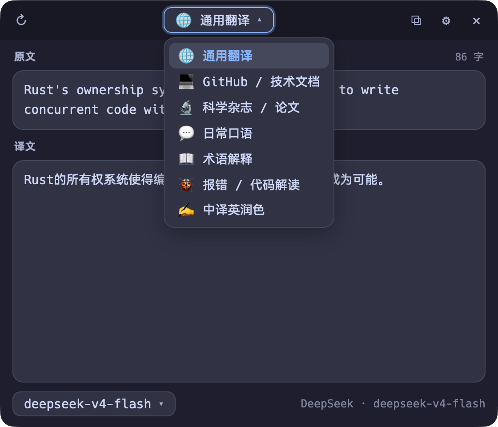
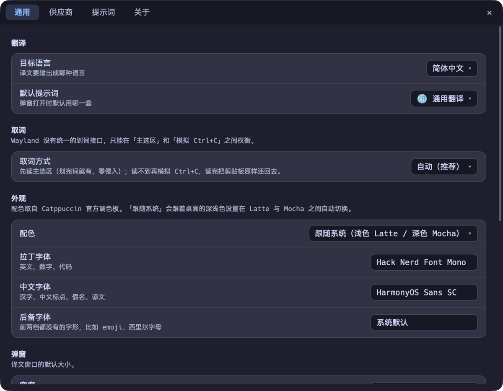

# selectionTranslation

Linux / macOS / Windows 上的全局划词翻译。**选中任意界面里的文字，按一下快捷键，屏幕右上角浮出译文。**

> 起家于 niri / Wayland，现在三个平台都能用。各平台的快捷键和安装方式见下。

不想选中也行：点托盘图标打开输入框，手敲或粘贴。

- 七种翻译风格随时切换（通用 / GitHub / 科学论文 / 口语 / 术语解释 / 报错解读 / 中译英）
- 十家模型供应商预设，选中即自动填好 base_url，模型列表实时拉取
- 常驻托盘，Catppuccin 配色，跟随系统深浅色
- 单文件二进制约 9 MB，运行时只依赖桌面本来就有的 gtk4 / libadwaita

<p align="center">
  
</p>

---

## 快速开始

### Linux（Arch / niri）

```bash
# 1. 装依赖
pac rust gtk4 libadwaita wl-clipboard ydotool
systemctl --user enable --now ydotool

# 2. 编译安装
git clone https://github.com/haibara-brownie/selectionTranslation.git
cd selectionTranslation
./install.sh
```

`install.sh` 会编译、装二进制和图标、写 niri 快捷键与窗口规则（**改 `config.kdl` 前先备份**）、开机自启并拉起托盘。加 `--no-niri` 不碰 niri 配置，加 `--no-autostart` 不设自启，`--uninstall` 卸载。

### macOS

从 [Releases](https://github.com/haibara-brownie/selectionTranslation/releases) 下 `.dmg`，拖进「应用程序」。

首次打开会说「无法打开，因为无法验证开发者」——安装包没有签名（见[下面](#mac--windows-上的注意事项)）。右键点图标 →「打开」即可。

**然后必须授权辅助功能**：系统设置 → 隐私与安全性 → 辅助功能 → 勾上 seltrans。取词要靠它，不授权按快捷键不会有任何反应。第一次按快捷键时系统也会主动弹这个请求。

> **升级之后要重新勾一次。** 未签名的应用每次构建出来的签名摘要都不一样，系统会认为「这不是之前授权过的那个应用」。不是程序坏了。

### Windows

从 [Releases](https://github.com/haibara-brownie/selectionTranslation/releases) 下 `.msi` 或 `-setup.exe`。SmartScreen 会拦一次，点「更多信息」→「仍要运行」。

不需要额外授权。

### 配一个模型（三个平台一样）

按打开设置的快捷键（见下表）→「供应商」页 → 点 **+** → 选预设（base_url 自动填好）→ 填 API key → 「拉取列表」挑模型 → 「测试连接」确认通了。

然后选中任意文字，按翻译快捷键。

## 怎么用

### 快捷键

**全局快捷键**（在任何应用里都生效）：

| | Linux | macOS | Windows |
|---|---|---|---|
| 翻译选中的文字 | `Mod+Shift+T` | `⌥⇧T` | `Alt+Shift+T` |
| 打开配置界面 | `Mod+Alt+T` | `⌥⇧,` | `Alt+Shift+,` |

mac / Windows 上这两个键**可以在设置页的「快捷键」里改**：点一下当前值进入录制，按下新组合即生效；被别的程序占了会当场告诉你。点「默认」恢复。

Linux 上改不了——Wayland 没有全局快捷键协议，键是 niri 拦的，改键请编辑 `~/.config/niri/selectiontranslation.kdl`。

> 为什么 mac / Windows 的默认值不跟 Linux 一致：全局快捷键是**系统级独占**的，注册之后所有应用里的这个组合都归 seltrans。而 `⌘⇧T` / `Ctrl+Shift+T` 恰好是所有浏览器的「重新打开关闭的标签页」，占掉它不划算。

**弹窗里的按键**（三个平台一样）：

| 按键 | 作用 |
|---|---|
| `Esc` | 收起弹窗 |
| `Ctrl+Enter` / `F5` | 重新翻译（输入框里回车是换行） |
| `Ctrl+Shift+C` | 复制译文 |

### 弹窗

上下两张卡片：**原文**和**译文**。

原文那张**是可以编辑的** —— 取词取歪了直接改，改完 `Ctrl+Enter` 重译；也可以什么都不选，打开它手敲或粘贴。右上角实时显示字数，取到空内容一眼就能看出来。

顶部下拉换翻译风格，底部换供应商和模型，**换完立刻用新设置重译同一段文字**，不用重新选词。

<p align="center">
  
</p>

下拉是自绘的，不是系统那套 —— 原生 `<select>` 的弹层由操作系统画，Linux 是 GTK 菜单、
macOS 是 NSMenu、Windows 又是第三种，配色和字体都跟应用对不上。自绘之后三个平台长一样。

### 托盘

| 操作 | 作用 |
|---|---|
| 左键点图标 | 打开弹窗并聚焦输入框 |
| 中键点图标 | 翻译当前选中的文字 |
| 右键 | 完整菜单：切风格、切供应商、设置、看日志、开关自启、退出 |
| 悬停 | 显示当前供应商 / 模型 / 风格 / 目标语言 |

常驻还有个实际好处：快捷键触发时是复用这个进程，省掉 GTK 冷启动，弹窗几乎瞬间出来。收起弹窗只是把窗口藏起来，进程和图标都还在。

### 翻译风格

| 风格 | 适合什么 |
|---|---|
| 🌐 通用翻译 | 默认，忠实又自然，只输出译文 |
| 💻 GitHub / 技术文档 | README、issue、commit message。代码、路径、命令、Markdown 结构原样保留 |
| 🔬 科学杂志 / 论文 | 学术书面语，术语给「中文（English）」对照，保留 LaTeX / 单位 / 引用标记 |
| 💬 日常口语 | 地道口语，保留语气和表情符号，俚语转成对应说法 |
| 📖 术语解释 | 先给译文，再补一段这个词是什么、用在哪、容易混淆在哪 |
| 🐞 报错 / 代码解读 | 讲清报错含义 + 常见原因 + 建议排查 |
| ✍️ 中译英润色 | 译成地道英文并润色 |

七条都能改，改坏了点「恢复内置提示词」就回来。也可以自己加。

### 命令行

```bash
seltrans popup                     # 取词并弹窗（快捷键调用的就是这个）
seltrans popup --input             # 打开输入框，不取词
seltrans settings [页面]           # 配置界面，页面可选 general/providers/prompts/about
seltrans tray                      # 常驻托盘（开机自启跑的就是这个）
seltrans translate --text "hello"  # 终端里翻译，不开窗口
echo "hello" | seltrans translate  # 也吃管道
seltrans autostart on|off          # 开关开机自启
seltrans log -f                    # 跟踪运行日志
```

迁移中的 Tauri 版是另一个二进制，子命令基本一致：

```bash
seltrans-tauri popup [--text ...] [--input]
seltrans-tauri settings [general|providers|prompts|about]
seltrans-tauri tray
```

两个二进制**共用同一份配置和日志**，可以随时来回切。

---

## 配置

按打开设置的快捷键，或点托盘图标右键 →「设置」。

<p align="center">
  
</p>

配置文件的位置按各平台的规矩来（不确定的话，「关于」页和 `seltrans --help` 都会打印实际路径）：

| 平台 | 位置 |
|---|---|
| Linux | `~/.config/seltrans/config.json` |
| macOS | `~/Library/Application Support/seltrans/config.json` |
| Windows | `%APPDATA%\seltrans\config.json` |

Unix 上权限是 `0600`（里面有 API key）。

### 供应商与模型

| 预设 | 接口 | base_url |
|---|---|---|
| DeepSeek | OpenAI 兼容 | `https://api.deepseek.com/v1` |
| 智谱 GLM | OpenAI 兼容 | `https://open.bigmodel.cn/api/paas/v4` |
| Kimi（Moonshot） | OpenAI 兼容 | `https://api.moonshot.ai/v1` |
| 硅基流动 | OpenAI 兼容 | `https://api.siliconflow.cn/v1` |
| 阿里百炼（通义千问） | OpenAI 兼容 | `https://dashscope.aliyuncs.com/compatible-mode/v1` |
| OpenRouter | OpenAI 兼容 | `https://openrouter.ai/api/v1` |
| OpenAI | OpenAI 兼容 | `https://api.openai.com/v1` |
| Anthropic Claude | Messages API | `https://api.anthropic.com` |
| Ollama（本地） | OpenAI 兼容 | `http://localhost:11434/v1` |
| 自定义 | OpenAI 兼容 | 自己填 |

**模型名不写死在程序里**，一律点「拉取列表」从 `/v1/models` 实时取 —— 各家迭代太快，写死很快就失效（`deepseek-chat` 已在 2026-07-24 停用，`moonshot-v1` 系列 2026-08-31 退役）。

> 划词翻译重延迟和成本，**建议挑各家的快档而不是旗舰**。有些旗舰（如 `kimi-k3`、`qwen3.8-max`）默认强制开启思考，会又慢又贵。

可以配多个供应商，在弹窗底部或托盘菜单里一键切换。

### 目标语言

「通用」页的下拉，内置 21 种主流大模型翻译质量都比较可靠的语种。选「自定义…」可以填任何模型看得懂的语言名。

存的是**语言名本身**而不是 ISO 代码 —— 它会直接替换提示词里的 `{target_lang}`，写「简体中文」比写 `zh-Hans` 稳定得多。

### 配色

「通用 → 外观 → 配色」，用的是 [Catppuccin](https://github.com/catppuccin/palette) 官方四个风味：

| 选项 | |
|---|---|
| 跟随系统 | 浅色用 Latte、深色用 Mocha，系统切换自动跟着换 |
| Latte | 浅色 |
| Frappé / Macchiato / Mocha | 三档深色，由浅到深 |

改完立刻生效，不用重开窗口。

### 字体

「通用 → 字体」有三档，都是带搜索的下拉（系统上几百个字体家族，不搜没法选）。搜索是**子串匹配**，搜 `maple` 能搜到 `JetBrains Maple Mono`：

| 档位 | 管什么 |
|---|---|
| 拉丁字体 | 英文、数字、代码 |
| 中文字体 | 汉字、中文标点、假名、谚文 |
| 后备字体 | 前两档都没有的字形，比如 emoji、西里尔字母 |

**整个界面都按字符脚本直接分配**：汉字一定用中文字体，其余按 拉丁 → 中文 → 后备 的顺序回退。

这一点很重要，因为 CSS 的 `font-family` 是**逐字符**回退的 —— 列表里第一个有该字形的字体就赢了。而 JetBrains Maple Mono 这类字体自带汉字，光靠回退顺序的话选它当拉丁字体就会把「中文字体」那档彻底架空。

所以不靠回退顺序猜。GTK 版：译文和原文区给汉字范围打 `GtkTextTag`，界面上的按钮、标签则遍历控件树逐个挂 Pango 属性。Tauri 版：用 `@font-face` 的 `unicode-range` 把两档**各自钉死**在自己的字符区间。结果都是同一行里 `lockfile` 用 Maple、汉字用衬线，泾渭分明。

> **中文字体那一档，要选真的有汉字的字体。**
> 举个真实的坑：`HarmonyOS Sans` 是纯拉丁族，**没有汉字**，带汉字的是 `HarmonyOS Sans SC`。
> 选错了的话，汉字既进不了中文档（它没有字形），也不会退给拉丁档（拉丁档被挡在汉字区外），
> 最后落到系统默认字体 —— 不会显示成豆腐块，但也不是你选的那个字体。

三档都选「系统默认」就完全不发 `font-family`，用系统的。只填拉丁字体不填中文字体时，
拉丁字体不受限制、管全部字符（它自带汉字这时候是好事）。

### 附加请求体

供应商配置里的「附加请求体」是一段 JSON，会合并进请求体，用来塞各家特有的参数：

```json
{"reasoning_effort": "none"}
```

程序**默认不发送 `temperature`** —— Claude 当前世代模型收到它会直接 400，部分推理模型也一样。需要的话在这里自己加。

---

## 排查

配置界面「关于」页有依赖自检，按平台给出各自要检查的东西：Linux 看 wl-clipboard / ydotool 服务 / niri 规则，macOS 看辅助功能授权，Windows 看 UI Automation 与剪贴板访问。

| 症状 | 怎么办 |
|---|---|
| 模型回「请提供需要翻译的内容」 | 发出去的用户消息是空的。先看弹窗里「原文」卡片的字数，再看日志里「发起翻译」那行的 `user 字符数`。多半是取到了空行或一串零宽字符 |
| 取不到词 | 确认按快捷键前文字确实选中着；某些应用不提供零副作用那条路（Electron 在 mac 上、老式控件在 Windows 上），把取词方式改成「自动」让它走模拟复制 |
| **mac**：按快捷键完全没反应 | 多半是辅助功能授权没了。系统设置 → 隐私与安全性 → 辅助功能，把 seltrans 取消勾选再重新勾上。**每次升级都要重来一遍**，见下 |
| **mac**：授权勾了还是不行 | 授权是进程启动时读的。勾完要退出 seltrans 再启动一次 |
| **mac / Windows**：快捷键没反应但程序在跑 | 组合被别的程序占了。看日志里「注册全局快捷键失败」，去设置页的「快捷键」换一组 |
| **Linux**：模拟 Ctrl+C 无效 | `systemctl --user status ydotool` 看服务在不在 |
| **Linux**：键盘像卡住了 | 修饰键被卡在按下状态，执行 `ydotool key 29:0 97:0 42:0 54:0 56:0 100:0 125:0 126:0` |
| **Linux**：快捷键没反应 | `niri validate` 看配置过没过；确认 `~/.local/bin` 在 PATH 里 |
| **Linux**：托盘没图标 | `seltrans tray` 手动跑一下看报什么；面板需要提供 `org.kde.StatusNotifierWatcher` |
| HTTP 401 / 404 | 弹窗里会直接显示服务端返回的原文，多半是 key 错了或 base_url 少了 `/v1` |

### 日志

```
~/.local/state/seltrans/seltrans.log
```

超 1 MB 自动轮转。`seltrans log -f` 跟踪，`SELTRANS_DEBUG=1` 可同时打到 stderr。**日志不记录 API key。**

翻译结果不对时先看这一行：

```
[INFO] 发起翻译 | 供应商=DeepSeek 模型=deepseek-v4-flash | system=315 字符 | user=53 字符
       | user 预览: The build failed because the lockfile is out of date.
```

`user 字符数` 和 `user 预览` 就是**真正发给模型的内容**。预览里会把肉眼看不见的字符标出来（`<ZWSP>`、`<BOM>`、`<NBSP>`）—— 网页上选到空行、图标字体时经常拿到一串零宽字符，看着像有内容其实什么都没有。这种情况程序会直接拦下不发请求。

---

## 原理与取舍

<details>
<summary>三个平台各自怎么取词</summary>

没有哪个系统提供「读取任意应用当前选中文本」的通用接口，所以每家都是**首选一条零副作用的路，读不到再模拟复制兜底**：

| 平台 | 首选（不碰剪贴板） | 兜底 |
|---|---|---|
| Linux / Wayland | 主选区 `wl-paste --primary` | 模拟 `Ctrl+C`（ydotool） |
| macOS | 辅助功能 API 读 `AXSelectedText` | 模拟 `⌘C` |
| Windows | UI Automation 的 `TextPattern` | 先 `Ctrl+Insert` 再 `Ctrl+C` |

几个值得说的细节：

- **Windows 上先发 `Ctrl+Insert`**：传统控制台（cmd / PowerShell 的 conhost）里 `Ctrl+C` 是中断信号而不是复制，会打断正在跑的命令；`Ctrl+Insert` 在那里才是复制。
- **Windows 的 UIA 要沿祖先链往上找**：Chromium / Edge / Electron 里拿到焦点的是一个带 `tabindex` 的容器，选区其实由祖先的 Document 元素持有。只问焦点元素的话，浏览器和 Electron 会全部掉进兜底。
- **macOS 上 Electron 应用读不到 `AXSelectedText`**（VS Code / Slack 都是），只能靠 `⌘C` 兜底——这不是 bug，是那些应用的辅助功能树里就没暴露。

兜底路径**读完都会把剪贴板还原**（只还原纯文本）。取词方式可以在设置里锁死成其中一种，默认「自动」。

</details>

<details>
<summary>模拟复制那条兜底路径的坑</summary>

模拟复制这条路有个坑（三个平台都有，只是键不同）：快捷键是 `Mod+Shift+T`，程序跑起来那一刻你手还按着 Super+Shift，这时直接发 Ctrl+C，应用收到的是 `Super+Shift+Ctrl+C` —— 既复制不到，还可能让合成器的修饰键状态和物理按键脱节，**表现就是键盘像卡住了**。所以发 Ctrl+C 前会先把左右 Ctrl / Shift / Alt / Super 全部显式抬起并等 120 ms，且用 RAII 守卫保证提前返回 / panic / 出错时一定再抬一次。

</details>

<details>
<summary>为什么弹窗不跟随鼠标</summary>

Wayland 下拿不到全局光标坐标，这是没法绕开的。弹窗固定在屏幕右上角，位置和尺寸可以改 `~/.config/niri/selectiontranslation.kdl` 里的窗口规则。
</details>

<details>
<summary>托盘图标为什么内嵌在二进制里</summary>

走的是 StatusNotifierItem over D-Bus，和 FlClash / Cherry Studio / cc-switch 同一套协议，任何提供 `org.kde.StatusNotifierWatcher` 的面板都能显示。

图标是**内嵌进二进制、启动时光栅化成 ARGB32 再经 D-Bus 递给面板**的，不走图标主题查找 —— 面板通常在自己启动时就把图标主题缓存住了，之后新装的图标按名字找不到，只会显示个首字母兜底（实测就是这样）。
</details>

<details>
<summary>写主题 CSS 踩过的坑</summary>

**别用裸的 `.background` 选择器** —— GtkPopover 自己也带这个样式类，一刷就会在弹层外面露出一圈窗口底色的方块。要用 `window`。

GTK4 的 popover **默认没有任何出现动画**（GTK3 有，GTK4 去掉了），得自己写 `@keyframes`。

CssProvider 默认静默忽略解析错误，接上 `parsing-error` 信号写进日志，才不会改坏了自己不知道。

**CSS 动画只在样式变化时重播**，而 popover 的节点是复用的 —— 第二次打开样式没变就不播了。解法是准备两套一模一样、只是名字不同的 `@keyframes`，每次 `map` 时在两个类之间来回切，强制 `animation-name` 变化。

**下拉搜索默认是前缀匹配**，`GtkDropDown` / `AdwComboRow` 的 `search-match-mode` 要显式设成 `Substring`（该属性需要 libadwaita 1.6+）。
</details>

---

## 开发

仓库是一个 cargo workspace，分**核心**与**界面**两层：核心不碰任何 GUI 工具包。
这条线是为支持 mac / Windows 划的 —— 换界面时核心那半边原样搬走。

界面层目前**有两套并存**：能用的 GTK4 版，和迁移中的 Tauri 版。
日常用的是 GTK 版；Tauri 版还只有弹窗，追平之后会取代它。

```
crates/seltrans-core/src/     核心逻辑（零 GUI 依赖，三平台通用）
├── config.rs       配置读写（原子写 + 0600）
├── presets.rs      供应商预设 + 目标语言列表 + 七条内置提示词
├── llm.rs          OpenAI 兼容与 Anthropic 两套流式后端 + SSE 解码器
├── logging.rs      日志、文本预览、零宽字符判空
├── palette.rs      Catppuccin 四风味色值
├── typography.rs   汉字区间表 + 按脚本分档的字体 CSS
└── selection/      取词，按平台切（mod.rs / linux.rs / unsupported.rs）

src/                          界面层 ①：GTK4 / libadwaita（当前可用）
├── main.rs         CLI 分发：popup / tray / settings / translate / log / autostart
├── popup.rs        翻译弹窗 + 常驻模式 + 托盘命令派发
├── settings_ui.rs  配置界面
├── theme.rs        把 palette 翻译成 GTK 认识的 CSS
├── fonts.rs        字体家族枚举 + Pango 属性按脚本分字体
├── tray.rs         StatusNotifierItem 托盘
└── autostart.rs    ~/.config/autostart 里的 desktop 文件读写

src-tauri/src/                界面层 ②：Tauri 2（迁移中）
├── main.rs         CLI 分流 + 插件注册 + Wayland app-id
├── windows.rs      窗口创建与复用、取词时序
├── cmds.rs         弹窗用的命令（薄搬运层，不放业务逻辑）
├── settings_cmds.rs 设置页用的命令
├── state.rs        首屏状态打包
└── tray.rs         托盘：Linux 走 ksni，mac/Win 走 Tauri 内置

ui/                           Tauri 的前端（Vite + TypeScript，无框架）
├── index.html / popup.ts     翻译弹窗
├── settings.html / settings.ts  设置窗口外壳
├── settings/                 四个页面各一个模块
│   └── general | providers | prompts | about
├── lib/
│   ├── dom.ts      控件词汇（命名对齐 libadwaita）
│   ├── api.ts      Rust 命令的类型化封装
│   └── shell.ts    配置的单一副本、模态框、状态栏
└── style.css / settings.css  只用 CSS 变量，不写死任何色值
```

往 core 里加东西之前先问一句：**这段代码在 mac 和 Windows 上还成立吗？**
平台相关的部分（取词、托盘、快捷键、自启）不属于 core。

```bash
cargo build --workspace                  # 编译（GTK 版 + Tauri 版）
cargo clippy --workspace --all-targets -- -D warnings   # 静态检查
cargo fmt --check
cargo test --workspace                   # 测试

pnpm install && pnpm tauri dev           # 开发时跑 Tauri 版（会同时起 vite）
pnpm tauri build --no-bundle             # 出一个能独立跑的 Tauri 二进制
```

> **`--workspace` 不能省。** 仓库根的 `Cargo.toml` 既是 workspace 根又是一个 package，
> 裸跑 `cargo build` / `cargo test` / `cargo clippy` **只作用于根包**，会静默跳过
> core 和 Tauri 那两个 crate 然后报 ok。

> **要能独立运行的 Tauri 二进制，必须走 `tauri build`，不能用 `cargo build --release`。**
> Tauri 靠 `tauri` 依赖有没有开 `custom-protocol` 特性来判断 dev / 生产
> （它的 build.rs 里就一行：`let dev = !has_feature("custom-protocol")`），
> 只有 `tauri build` 会加这个特性。`cargo build` 编出来的二进制会去连 `devUrl`，
> 窗口一片空白、左上角写着 `Connection refused` —— 跟 `--release` 与否无关。

技术栈：Rust 2024 + GTK4 / libadwaita（`gtk4` 0.11、`libadwaita` 0.9）+ Tauri 2.11、tokio、reqwest（rustls）、ksni（托盘）、jiff（时间戳）；前端 Vite 7 + TypeScript，不上框架。无数据库，配置落 XDG 目录。

### 迁移进度

| 阶段 | 内容 | 状态 |
|---|---|---|
| P0 | 抽出 `seltrans-core`，核心逻辑与 GUI 解耦 | 完成 |
| P1 | Tauri 骨架 + 翻译弹窗 | 完成 |
| P2 | 设置界面四页搬到 Tauri | 完成 |
| P3 | mac / Windows 取词、托盘、自启、单实例 | 代码完成，**mac/Win 未经真机验证** |
| P4 | 三平台打包 CI | 配置完成，**未跑过一次真实 CI** |
| P5 | 删掉 GTK 版 | **未做**，等 Tauri 版在日常使用中站住脚 |

两套界面目前并存：`seltrans`（GTK4，日常在用）和 `seltrans-tauri`（迁移中）。
切换之前会给 GTK 版打 tag 留退路。

### Tauri 版的已知限制

- **全局快捷键在 Linux 上只能由合成器提供**。Wayland 没有对应协议，Tauri 的
  global-shortcut 插件在 Wayland 下注册会"成功"但回调永不触发（上游长期未决）。
  所以走的是「合成器 spawn 一个新进程 → 单实例插件把 argv 递给常驻实例」这条路，
  实测第二个进程 0.055 秒就退出。mac / Windows 上才用得了插件。
- **窗口位置由合成器决定**。Wayland 下客户端没权限摆自己，靠 niri 的窗口规则按
  app-id + 标题匹配，见 `data/niri-snippet.kdl`。
- **Linux 托盘用 ksni 而不是 Tauri 内置那套**。内置的依赖 libayatana-appindicator，
  且有已知问题（Wayland 下 .deb 和 dev 模式图标不显示，只有 AppImage 正常）。
- **Windows 的取词还没有真机验证过**。UI Automation 那条路已经写完并做了类型检查
  （在 mac 上交叉编译到 Windows 目标），但运行时行为必须实机试。mac 已经真机验过：
  原生应用走辅助功能 API、Electron 掉模拟复制兜底、剪贴板还原都正确。

### mac / Windows 上的注意事项

**安装包没有签名。** 没有 Apple 开发者账号（$99/年）就没法公证，Windows 也没有代码
签名证书。所以：

- **macOS**：首次打开会说「无法打开，因为无法验证开发者」。右键点图标 →「打开」，
  或者 `xattr -dr com.apple.quarantine /Applications/seltrans.app`
- **Windows**：SmartScreen 会拦一次，点「更多信息」→「仍要运行」

**取词的平台限制：**

| 平台 | 限制 |
|---|---|
| macOS | 需要「辅助功能」授权（系统设置 → 隐私与安全性 → 辅助功能）。**升级之后要重新勾一次** —— 未签名应用每次构建的签名摘要都不一样，系统认不出是同一个应用 |
| macOS | 从终端跑裸二进制时，被授权的其实是终端；装成 .app 之后要重新勾 |
| Windows | **UIPI 挡住提权窗口** —— 目标程序以管理员身份运行时取不到词，这是系统安全设计，只能让 seltrans 也以管理员身份运行 |
| Windows | 用 Raw Input / DirectInput 读键盘的程序（多数游戏）会无视注入的按键 |

**剪贴板只还原纯文本。** 走模拟复制那条兜底路径时会临时改写剪贴板再还原，但原本
是图片、富文本、文件列表的话还不回去（会变成空）。三个平台都是这样，是已知取舍。

不想冒这个险，就把「取词方式」设成**「仅主选区」**——那一档在三个平台上都表示
「只走零副作用的那条路，读不到就明确报错，绝不动剪贴板」：

| 平台 | 零副作用的那条路 |
|---|---|
| Linux | 主选区（`wl-paste --primary`） |
| macOS | 辅助功能 API（`AXSelectedText`） |
| Windows | UI Automation（`TextPattern`） |

代价是覆盖面小一些：Electron 应用（VS Code / Slack）在 mac 上读不到，老式 Win32 控件
在 Windows 上读不到，那些场景只能靠模拟复制。

## 许可

MIT
